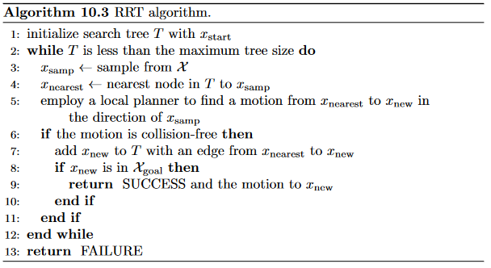
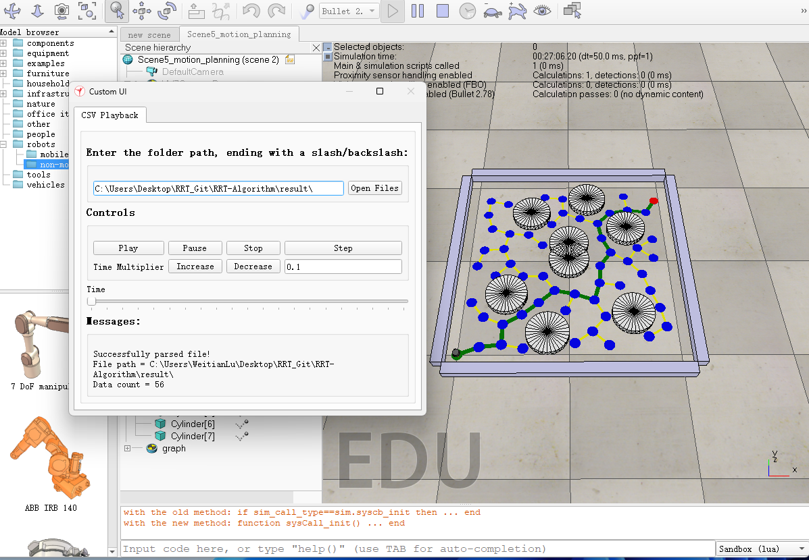

# RRT-Algorithm
This is a **RRT (Rapid Random Tree)** algorithm for robot motion planning, as a [practice](https://hades.mech.northwestern.edu/index.php/Sampling-Based_Planning) belongs to Modern Robotics: Mechanics, Planning, and Control (Lynch, 2017).
The pseudocode for the algorithm is shown below:


# How to use this code?
- Before run `rrt.py`, please ensure that there is a `result` folder in the code directory, and a `obstacles.csv` file in `result` folder, which the obstacles are stored according to the format below:
```csv
# obstacles.csv file for V-REP kilobot motion planning scene.
# All lines beginning with a # are treated as a comment and ignored.
# Below is a specification of a set of cylindrical obstacles in the form
# x,y,diameter
# where (x,y) is the center of the cylinder and diameter is its diameter.
0.0, 0.0, 0.2
0.0, 0.1, 0.2
0.3, 0.2, 0.2
-0.3, -0.2, 0.2
-0.1, -0.4, 0.2
-0.2, 0.3, 0.2
0.3, -0.3, 0.2
0.1, 0.4, 0.2
```

When `rrt.py` finishes and finds a path, the program will generate `edges.csv`, `nodes.csv`, `path.csv` in `result` folder.
- `nodes.csv` contains the coordinate of random sampling points:
```
# nodes.csv
#id,x,y
1,-0.5,-0.5
2,-0.40690790146326933,-0.4634779355727578
3,-0.30754667302698085,-0.45219315451011843
4,-0.3093424730636714,-0.3522092802991827
5,-0.2226330446346893,-0.3023948745361985
6,-0.14558741384262164,-0.23864559394533696
........
```

- `edges.csv` contains the distance between $x_{nearest}$ and $x_{new}$:
```
# edges.csv
# All lines beginning with a # are treated as a comment and ignored.
#id1,id2,edges
2,1,0.10000000000000002
3,2,0.10000000000000003
4,3,0.1
5,4,0.1
........
```

- `path.csv` contains the path:
```
#path.csv
1,2,3,4,5,6,7,8,11,12,14,16,27,37,44,49,55,56
```

# Visualize the algorithm
The visualization of algorithm is based on [**the CoppeliaSim robot simulation environment**](https://www.coppeliarobotics.com/) software, please download scene 5 from [this link](https://hades.mech.northwestern.edu/index.php/CoppeliaSim_Introduction).
In the Coppeliasim, please open scene 5 and copy th `result` path, you can see the algorithm after pressing "Open Files"


# Next Step
The next step is using matplotlib for visualization......

## Reference
Lynch Kevin, M., & Park Frank, C. (2017). Modern Robotics: Mechanics, Planning, and Control.